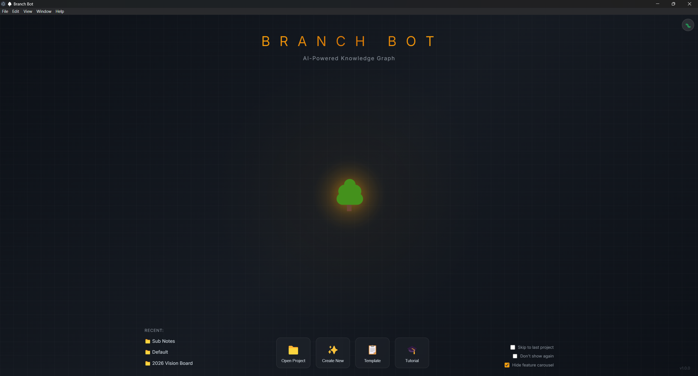
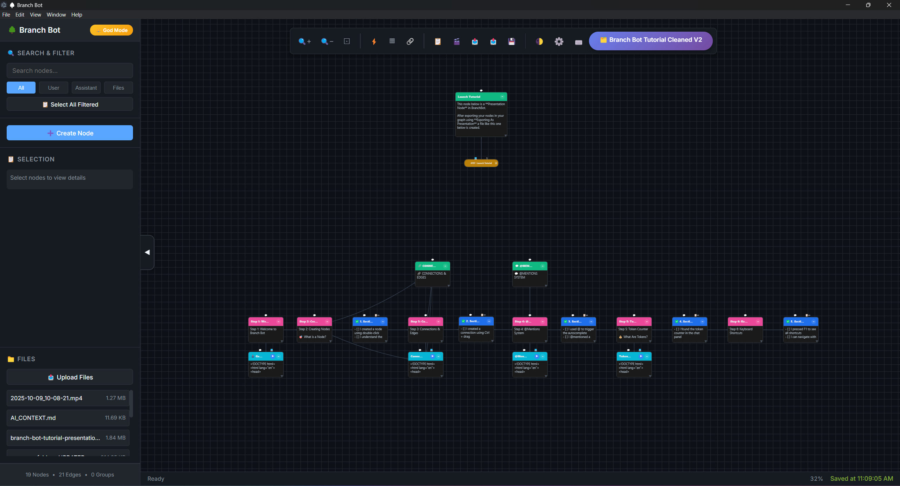
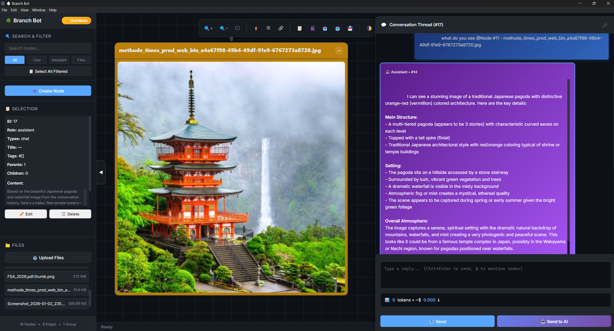
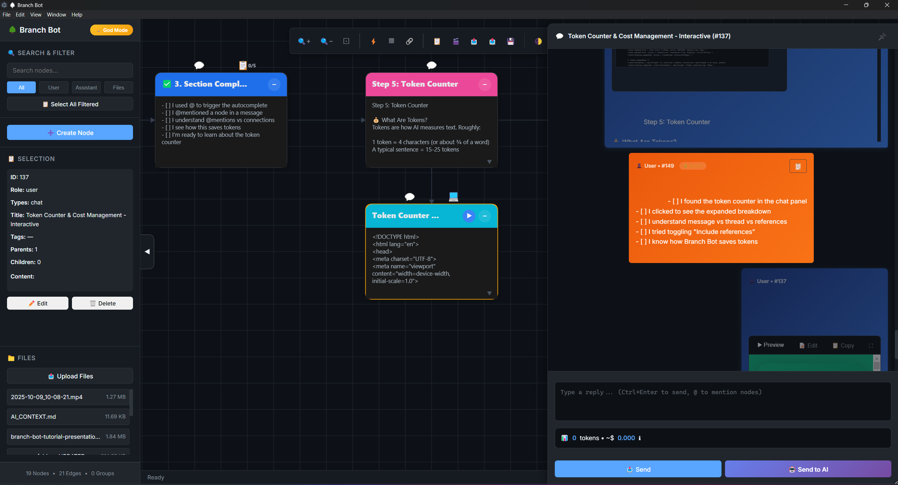
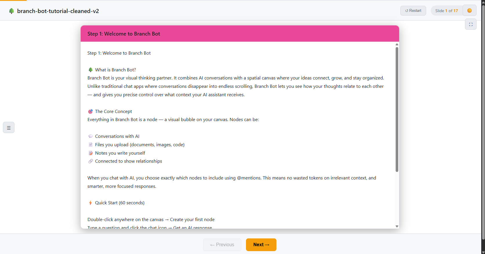

# 🌳 Branch Bot

**AI-powered visual knowledge graph that runs 100% locally.**

Organize research, connect ideas, and export interactive presentations — without your data ever leaving your computer.

[Download](#-installation) • [Features](#-features) • [Screenshots](#-screenshots) • [Pricing](#-pricing) • [Documentation](#-documentation)

---

---

## 🎯 What is Branch Bot?

Branch Bot is a **visual knowledge management tool** with built-in AI chat. Think of it as a mind map meets AI notebook — where every idea is a node you can see, connect, and explore.

**Perfect for:**
- 🔍 Private investigators organizing case evidence
- 🌐 OSINT analysts mapping entity relationships
- ⚖️ Legal researchers tracking precedents
- 🎓 Educators building interactive lessons
- 🧠 Anyone who thinks better visually

**Why Branch Bot?**
- Your data stays on YOUR computer (not our servers)
- See exactly what context you're sending to AI (and what it costs)
- Export your research as interactive HTML presentations
- Works great even without AI — it's a powerful visual organizer

---

## ✨ Features

### 🌳 Visual Knowledge Graph
Drag, drop, and connect nodes on an infinite canvas. See how your ideas relate at a glance.

### 🤖 AI-Powered Chat
Claude AI built right in. Ask questions, get insights, and generate content with full project context.

### 📊 Token Transparency
See exactly what you're sending to the AI — message tokens, thread history, references, and estimated cost. No surprises.

### 🎬 Presentation Export
Turn any graph into a standalone HTML presentation. Works offline, runs code demos live, perfect for client reports.

### 📁 File Organization
Drag in any file — images, PDFs, code, documents. Everything becomes a visual node in your graph.

### 🔒 100% Local & Private
All data stored in SQLite databases on your machine. We never see your research.

### ⌨️ Keyboard-First
Every action has a shortcut. Navigate, edit, and organize at the speed of thought.

### 🎨 Light & Dark Themes
Easy on the eyes, day or night.

---

## 📸 Screenshots

| Graph View | AI Chat |
|------------|---------|
|  |  |

| File Preview | Presentation Export |
|--------------|---------------------|
|  |  |

---

## 🚀 Installation

### Download

| Platform | Download |
|----------|----------|
| **Windows** | [BranchBot-Setup-1.0.0.exe](https://github.com/massiaharts-commits/branchbot-updates/releases/download/v1.0.0/BranchBot_v1.0.0_Windows.zip) |
| **Mac (Intel)** | Coming Soon |
| **Mac (Apple Silicon)** | Coming Soon |
| **Linux** | Coming Soon |

> **Note:** Replace `#` with actual download links from your releases page or website.

### System Requirements

- **Windows:** Windows 10 or later
- **Mac:** macOS 10.15 (Catalina) or later
- **Linux:** Ubuntu 18.04+ or equivalent
- **RAM:** 4GB minimum, 8GB recommended
- **Storage:** 200MB for app, plus space for your projects

---

## ⚡ Quick Start

1. **Download and install** Branch Bot for your platform
2. **Launch the app** — you'll see the welcome screen
3. **Create a project** or start with a template
4. **Create your first node** — click "+ Create Node" or double-click the canvas
5. **Connect nodes** — Ctrl+click to draw connections
6. **Chat with AI** — Select a node and open the chat panel

**That's it!** You're ready to build your knowledge graph.

### Keyboard Shortcuts (Essential)

| Action | Shortcut |
|--------|----------|
| Create Node | `Ctrl+N` or double-click canvas |
| Connect Nodes | `Ctrl+Click` on target |
| Delete Selected | `Delete` |
| Undo | `Ctrl+Z` |
| Redo | `Ctrl+Y` |
| Search | `Ctrl+F` |
| Toggle Sidebar | `Ctrl+B` |
| Toggle Chat | `Ctrl+Shift+C` |
| Send to AI | `Ctrl+Enter` |
| Help | `F1` |

---

## 💰 Pricing

Branch Bot offers a **free tier** plus paid plans for power users.

| Plan | Price | Projects | Nodes | AI Calls |
|------|-------|----------|-------|----------|
| **Free** | $0 | 2 | 50 | 5/mo |
| **Starter** | $8/mo | 5 | 500 | 150/mo |
| **Pro** | $19/mo | 20 | 2,500 | 400/mo |
| **Pro Max** | $59/mo | Unlimited | Unlimited | 1,000/mo |

**BYOK (Bring Your Own Key):** All paid plans have discounted BYOK variants where you use your own Anthropic API key.

**Yearly billing:** Save up to 27% with annual plans.

👉 [View full pricing](https://massiaharts-commits.github.io/branchbot-updates/landing-page.html#pricing)

---

## 🛠️ Tech Stack

Branch Bot is built with:

- **Frontend:** Vanilla JavaScript, HTML5 Canvas
- **Backend:** Python Flask, SQLAlchemy ORM
- **Desktop:** Electron wrapper
- **Database:** SQLite (one per project)
- **AI:** Anthropic Claude API
- **PDF Processing:** PyMuPDF
- **Syntax Highlighting:** Highlight.js, Pygments

**Why this stack?**
- Simple, maintainable, fast
- No complex build processes
- Easy to package as standalone executable
- Users don't need Python/Node installed

---

## 🔒 Privacy

**Your data never leaves your computer.**

- All notes, files, and graphs stored locally in SQLite
- AI messages go directly to Anthropic (or via our relay for hosted plans)
- We don't log or store your content
- Analytics (Microsoft Clarity) can be disabled in Settings
- API keys encrypted before storage

👉 [Read full Privacy Policy](https://massiaharts-commits.github.io/branchbot-updates/privacy.html)

---

## 📖 Documentation

### Guides

- [Getting Started](docs/getting-started.md)
- [Working with Nodes](docs/nodes.md)
- [AI Chat Features](docs/ai-chat.md)
- [Presentation Export](docs/presentations.md)
- [Keyboard Shortcuts](docs/shortcuts.md)
- [BYOK Setup](docs/byok.md)

### FAQ

<strong>Does Branch Bot work offline?</strong>

Yes! Everything except AI features works without internet. Your data is stored locally.

<strong>Can I export my data?</strong>

Absolutely. Export as JSON, HTML presentation, or access the raw SQLite database directly.

<strong>What's BYOK?</strong>

Bring Your Own Key — use your own Anthropic API key instead of our hosted credits. You pay Anthropic directly for usage.

<strong>Is my data secure?</strong>

Yes. Everything is stored locally on your machine. We never see, access, or store your research.

<strong>What if I hit my node limit?</strong>

You'll see a notification. Upgrade your plan or delete unused nodes to make room.

---

## 🐛 Support & Feedback

### Report a Bug

Use the 🐛 button in the app (top-right corner) to submit bug reports with automatic system info.

Or email: **support@branchbot.app**

### Feature Requests

We'd love to hear your ideas! Email us or open a discussion on GitHub.

### Community

- 📧 Email: support@branchbot.app
- 🐦 Twitter: [@branchbotapp](#) *(coming soon)*
- 💬 Discord: [Join our server](#) *(coming soon)*

---

## 🗺️ Roadmap

### Coming Soon

- [ ] Browser extension for web clipping
- [ ] Mobile capture app (send images/links from phone)
- [ ] Daily/weekly digest emails
- [ ] Focus mode for deep work
- [ ] Template marketplace

### Under Consideration

- [ ] Real-time collaboration
- [ ] Plugin system
- [ ] Custom AI providers (GPT-4, local LLMs)
- [ ] Mobile app (full version)

Want to influence the roadmap? [Let us know](mailto:support@branchbot.app) what matters most to you!

---

## 📄 License

Branch Bot is **proprietary software** with a free tier.

- Free tier: Use forever with limitations
- Paid tiers: Licensed per-user, subscription-based
- Your data: Always yours, stored locally, exportable anytime

See [LICENSE](LICENSE) for full terms.

---

## 🙏 Acknowledgments

Branch Bot is built on the shoulders of giants:

- [Anthropic](https://anthropic.com) — Claude AI
- [Electron](https://electronjs.org) — Desktop framework
- [Flask](https://flask.palletsprojects.com) — Python backend
- [Highlight.js](https://highlightjs.org) — Syntax highlighting
- [Marked](https://marked.js.org) — Markdown parsing
- [PDF.js](https://mozilla.github.io/pdf.js/) — PDF rendering

---

**Built with ❤️ by a solo developer who believes your research should stay yours.**

[Website](https://massiaharts-commits.github.io/branchbot-updates/landing-page.html#) • [Download](#-installation) • [Pricing](#-pricing) • [Privacy](https://massiaharts-commits.github.io/branchbot-updates/landing-page.html#privacy)

